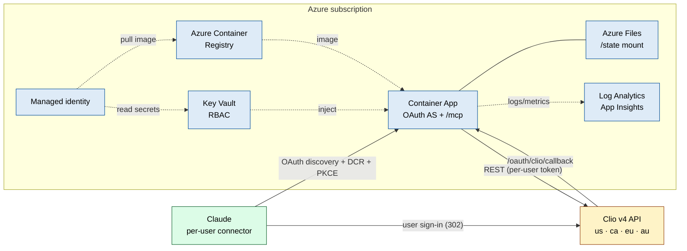
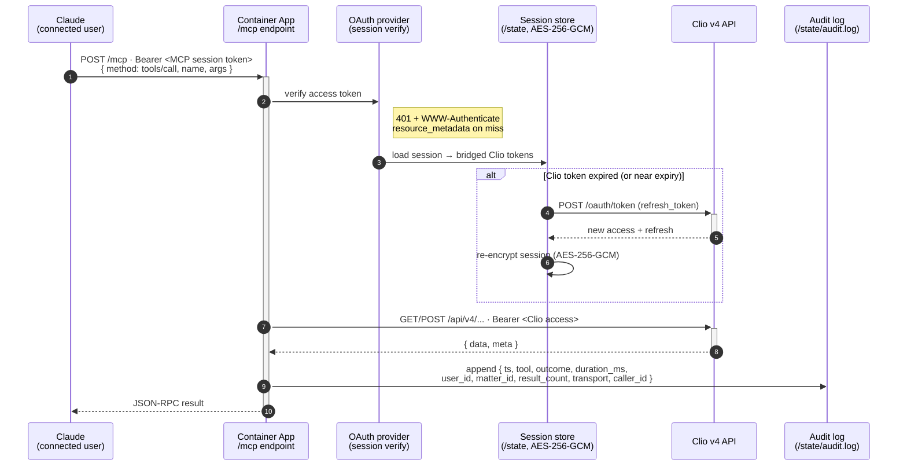

# Clio Manage MCP

[](LICENSE)
[](https://nodejs.org)
[](https://www.typescriptlang.org)
[](https://modelcontextprotocol.io)
[](https://github.com/patrickking67/clio-mcp/actions/workflows/build.yml)
[](#roadmap)

> A Model Context Protocol server for **Clio Manage** — deployed on Azure as a
> **per-user remote OAuth connector** for Claude, with a full-featured local
> stdio path for development and solo use. Same binary, two ways to connect.

**Built with**


This server is the boundary between an AI agent (Claude or any
MCP-compatible client) and your firm's Clio Manage instance. It speaks Clio
v4 fluently — matters, contacts, activities, tasks, notes, calendar,
documents, bills — and exposes it as a **remote custom connector**: each
attorney adds one URL in Claude, signs in to **their own** Clio account, and
is connected. Tokens are encrypted at rest, every tool call is audited, and
nothing about a user's Clio data is shared with anyone else's session.

**What's in the box**

- A **remote OAuth 2.1 custom connector** for Claude: per-user sign-in to Clio,
  Dynamic Client Registration, PKCE, served from Azure Container Apps
- 41 tools across 11 Clio domains, plus a generic `clio_api_request` escape hatch
- A composite intake workflow (`clio_open_new_matter`) that chains client +
  matter + opening note + intake task into one agent action
- Per-session, AES-256-GCM encrypted Clio tokens, multi-replica safe on shared storage
- Append-only JSONL audit log designed around ABA Formal Opinion 512

**What's different about this one**

- **Per-user OAuth, not a shared key.** The headline mode (`MCP_AUTH_MODE=oauth`)
  turns this server into an OAuth 2.0 Authorization Server + Protected Resource
  that bridges each Claude user to their own Clio account. No bearer tokens to
  hand out, no shared login. Claude does discovery → registration → PKCE → the
  user signs in on Clio. A simpler shared-token `static` mode is still available.
- **Azure-native.** A single `azd up` provisions Container Apps + ACR + Key
  Vault + Azure Files + Log Analytics, defaults to OAuth mode, and auto-sets
  `PUBLIC_BASE_URL` from the environment domain. Secrets flow from Key Vault to
  the container via managed identity — never on disk.
- **End-to-end verified.** `npm run smoke:stdio`, `npm run smoke:http`, and
  `npm run smoke:oauth` drive a real MCP session — including the full OAuth
  discovery handshake — against the built binary. CI blocks regressions in protocol
  shape, tool registration, auth gating, and resource publication.
- **Multi-region.** US / CA / EU / AU Clio endpoints via one `CLIO_REGION` env.

---

## Contents

1. [What you can ask Claude](#what-you-can-ask-claude)
2. [How connecting works](#how-connecting-works)
3. [Architecture](#architecture)
4. [Quick start — Azure (remote connector)](#quick-start--azure-remote-connector)
5. [Quick start — local (stdio)](#quick-start--local-stdio)
6. [Tool catalog](#tool-catalog)
7. [Resources](#resources)
8. [Configuration](#configuration)
9. [Security & compliance posture](#security--compliance-posture)
10. [Cost (Azure)](#cost-azure)
11. [FAQ](#faq)
12. [Verification](#verification)
13. [Confirmed Clio API quirks](#confirmed-clio-api-quirks)
14. [Claude Code plugin](#claude-code-plugin)
15. [Optional connectors](#optional-connectors)
16. [Landing page](#landing-page)
17. [Development](#development)
18. [Related work](#related-work)
19. [Roadmap](#roadmap)
20. [License](#license)

---

## What you can ask Claude

Once connected, these are real prompts that route through the connector. The
tool calls happen transparently; the agent picks what to call from the catalog.
In OAuth mode each result reflects **that user's** Clio account.

**Matter lookup**

> "Show me all open matters for Acme Corp."
> "What's the status of matter 2024-0042?"
> "Which matters have been updated since last Monday?"

**Time & billing**

> "How many hours has the team logged on matter 4821 this month?"
> "What's the outstanding balance on matter 4821 and when was the last
> invoice issued?"
> "List all unbilled time entries from Jane in April."

**Intake (composite workflow)**

> "Open a new matter for Jane Smith — landlord/tenant, flat fee $2,500.
> Add an opening note summarising the consultation, and create an intake
> task due Friday."

That last one is one `clio_open_new_matter` call that creates the contact,
opens the matter, applies the flat-fee custom rate, attaches the note, and
schedules the task.

**Drafting (writes a note)**

> "Add a note to matter 4821: today's call covered scope and engagement
> letter; client confirmed retainer."

**Calendar & tasks**

> "What do I have on the calendar between April 28 and May 2?"
> "Show my pending tasks across all open matters, grouped by priority."

**Reporting / cleanup**

> "List all bills in `awaiting_payment` state older than 60 days, grouped by
> client."
> "Find every contact created this year that isn't linked to a matter."

The connector retrieves Clio data live on every request. Nothing is cached
or mirrored.

---

## How connecting works

There are two ways to connect, selected by `MCP_AUTH_MODE`.

**OAuth — remote custom connector (headline, Azure default).** Each user adds
the connector once and signs in to their own Clio account:

1. In Claude: **Settings → Connectors → Add custom connector**.
2. Paste the connector URL: `${PUBLIC_BASE_URL}/mcp`
   (e.g. `https://ca-cliomcp-prod.<region>.azurecontainerapps.io/mcp`).
3. Claude runs OAuth discovery, registers itself via Dynamic Client
   Registration, and starts a PKCE authorization-code flow.
4. The user is redirected to **Clio** to sign in and authorize.
5. Clio returns to the server's `/oauth/clio/callback`, the server bridges the
   Clio tokens into an MCP session, and Claude lands back **connected**.

No bearer token is pasted anywhere. Each user's Clio tokens are encrypted and
isolated to their own session.

**Static — shared bearer token (secondary, single-tenant).** A simpler mode for
solo or single-account setups: one shared bearer token gates `/mcp`, mapped to a
single shared Clio account seeded from a refresh token. See
[Quick start — Azure](#quick-start--azure-remote-connector) (optional static
variant) and [docs/oauth-setup.md](docs/oauth-setup.md).

**Local (stdio).** For development and solo use, the binary runs as a local
stdio MCP server and authorizes through the loopback OAuth flow — no public URL
needed. See [Quick start — local](#quick-start--local-stdio).

---

## Architecture

Azure deployment in OAuth mode (primary). The server is an OAuth 2.0
Authorization Server + Protected Resource that bridges each Claude user to their
own Clio account:

```
                    Azure subscription
   ┌──────────────────────────────────────────────────────────┐
   │                                                           │
   │   ┌────────────┐  HTTPS   ┌──────────────┐   ┌─────────┐  │
   │   │  Claude    │─────────►│ Container    │──►│ Clio v4 │  │
   │   │ (each user │  OAuth   │ Apps         │   │  API    │  │
   │   │  signs in) │  + /mcp  │ (stateless)  │   └─────────┘  │
   │   └────────────┘          └──────┬───────┘                │
   │       ▲  per-user Clio sign-in   │                        │
   │       └──────────────────────────┘ (302 via Clio login)   │
   │                  ┌───────────────┼──────────────┐         │
   │                  │               │              │         │
   │             ┌────▼─────┐  ┌──────▼─────┐ ┌──────▼──────┐  │
   │             │ Key Vault│  │ Azure Files│ │ App Insights│  │
   │             │  (RBAC)  │  │  /state    │ │ + Log Anal. │  │
   │             └──────────┘  └────────────┘ └─────────────┘  │
   │                  ▲     (tokens.enc + sessions/ + audit)    │
   │         ┌────────┴─────────┐                               │
   │         │ Managed identity │                               │
   │         │ (KV secrets user │                               │
   │         │  + ACR pull)     │                               │
   │         └──────────────────┘                               │
   └──────────────────────────────────────────────────────────┘
```

Or as a Mermaid graph (renders inline on GitHub):



Resources provisioned by [`infra/main.bicep`](infra/main.bicep):

| Resource                             | Purpose                                                  |
|--------------------------------------|----------------------------------------------------------|
| Log Analytics + Application Insights | Logs, metrics, traces                                    |
| Azure Container Registry (Basic)     | Private image registry, anonymous pull disabled          |
| User-assigned managed identity       | ACR pull + Key Vault Secrets User                        |
| Azure Key Vault (RBAC, soft-delete)  | Stores the Clio app + encryption secrets                 |
| Azure Storage + File Share           | Persistent `/state` mount (tokens.enc, sessions/, audit) |
| Container Apps environment           | Hosts the workload, file share registered                |
| Container App                        | HTTPS ingress, OAuth default, autoscale 1→4 by default   |

### HTTP surface

| Endpoint | Purpose |
|---|---|
| `GET /healthz` | Liveness — always 200 (`{ status, server, auth_mode, region }`) |
| `GET /readyz` | Readiness — 200 in OAuth mode; in static/hybrid, 503 until the shared account is authenticated |
| `POST /mcp` | The MCP endpoint (auth-protected). On 401 it returns `WWW-Authenticate` with `resource_metadata=".../.well-known/oauth-protected-resource/mcp"` |
| `GET\|DELETE /mcp` | 405 (the server is stateless POST-only) |

In `oauth` / `hybrid` mode the server additionally serves the OAuth
Authorization Server + Protected Resource surface:

| Endpoint | Purpose |
|---|---|
| `GET /.well-known/oauth-authorization-server` | Authorization Server metadata (discovery) |
| `GET /.well-known/oauth-protected-resource/mcp` | Protected Resource metadata for `/mcp` |
| `POST /register` | Dynamic Client Registration |
| `GET /authorize` | Authorization endpoint (302s the user to Clio) |
| `POST /token` | Token endpoint (PKCE; authorization_code + refresh_token) |
| `POST /revoke` | Token revocation |
| `GET /oauth/clio/callback` | Clio's redirect target; completes the bridge |

### Request lifecycle (OAuth mode)

What happens when a connected user invokes a tool — session-token check, Clio
token refresh, Clio call, and audit log, end-to-end:



---

## Quick start — Azure (remote connector)

> Primary path. ~15 minutes the first time. Ends with attorneys adding the
> connector in Claude and signing in to Clio themselves.

### Prerequisites

- Azure subscription with the `Microsoft.App` and `Microsoft.ContainerRegistry`
  providers registered
- `az`, `azd`, and Docker installed locally
- A **Clio Developer Application** (one per deployment). You'll register its
  redirect URI in step 4, after `azd up` tells you the public URL.

### 1. Provision (defaults to OAuth mode)

```bash
az login
azd auth login
azd env new clio-mcp-prod
azd env set AZURE_LOCATION eastus2
azd env set CLIO_REGION us           # us | ca | eu | au
azd up                                # builds image, runs Bicep, deploys
```

`azd up` deploys with `MCP_AUTH_MODE=oauth` (the infra default) and **auto-sets
`PUBLIC_BASE_URL`** from the Container Apps environment domain — you never set it
by hand.

### 2. Populate Key Vault (3 secrets)

OAuth mode needs exactly three secrets. (No shared bearer token, no bootstrap
refresh token — each user authorizes themselves.)

```bash
KV=$(azd env get-values | awk -F= '/AZURE_KEY_VAULT_NAME/{print $2}' | tr -d '"')

az keyvault secret set --vault-name "$KV" --name clio-client-id      --value "<from Clio>"
az keyvault secret set --vault-name "$KV" --name clio-client-secret  --value "<from Clio>"
az keyvault secret set --vault-name "$KV" --name clio-encryption-key --value "$(openssl rand -hex 32)"
```

### 3. Restart the revision so the secrets bind

```bash
APP=$(azd env get-values | awk -F= '/SERVICE_API_NAME/{print $2}' | tr -d '"')
RG=$(azd env get-values | awk -F= '/AZURE_RESOURCE_GROUP/{print $2}' | tr -d '"')
az containerapp revision restart -n "$APP" -g "$RG"
```

### 4. Register the redirect URI in Clio, then verify

Grab the public URL and register the connector callback on your Clio Developer
Application (*Settings → Developer Applications*):

```bash
BASE=$(azd env get-values | awk -F= '/SERVICE_API_URI/{print $2}' | tr -d '"')
echo "Register this Redirect URI in Clio: ${BASE}/oauth/clio/callback"

curl -sS "${BASE}/healthz"
# {"status":"ok","server":"clio-mcp","auth_mode":"oauth","region":"us"}
```

### 5. Add the connector in Claude → sign in to Clio

Share the connector URL with each attorney (it's the same for everyone):

```
${PUBLIC_BASE_URL}/mcp      # e.g. https://<your-app>.<region>.azurecontainerapps.io/mcp
```

In Claude: **Settings → Connectors → Add custom connector → paste the URL.**
Claude runs OAuth discovery + dynamic client registration, redirects the user to
**Clio** to sign in and authorize, and returns connected. Each user connects
their own Clio account.

Full walk-through (custom domain, logs, audit export, rotation, troubleshooting,
and the optional shared-account variant): [docs/deployment-azure.md](docs/deployment-azure.md).

### Optional: shared-account (static) variant

For a single-tenant deployment where one shared Clio login is acceptable, deploy
in `static` mode instead and seed a shared bearer token + refresh token:

```bash
azd env set MCP_AUTH_MODE static
azd up
# then also set the two static-mode secrets in Key Vault and restart:
#   clio-http-auth-tokens   (a bearer token your clients present on /mcp)
#   clio-refresh-token      (from examples/bootstrap-refresh-token.mjs)
```

Details: [docs/deployment-azure.md](docs/deployment-azure.md) and
[docs/oauth-setup.md](docs/oauth-setup.md).

---

## Quick start — local (stdio)

> Development, single-user, or seeding a shared-account refresh token for static mode.

```bash
git clone https://github.com/patrickking67/clio-mcp.git
cd clio-mcp
npm install
npm run build
cp .env.example .env
# fill: CLIO_CLIENT_ID, CLIO_CLIENT_SECRET, CLIO_ENCRYPTION_KEY (openssl rand -hex 32)
```

Register `http://127.0.0.1:5678/callback` as a Redirect URI on your Clio
Developer Application (Clio allows several, so the same app can serve both local
stdio and the remote connector). Then wire the server into Claude Desktop /
Claude Code with one of the [examples/](examples/), and run `authenticate with
Clio` in a conversation. The encrypted token blob lives at
`~/.clio-mcp/tokens.enc` and auto-refreshes ahead of expiry. Full guide:
[docs/deployment-local.md](docs/deployment-local.md).

> You can also run the HTTP transport locally in `hybrid` mode for connector
> development by setting `PUBLIC_BASE_URL=http://localhost:8765` — see
> [docs/deployment-local.md](docs/deployment-local.md).

---

## Tool catalog

| Domain          | Tools                                                                                   |
|-----------------|-----------------------------------------------------------------------------------------|
| Auth            | `clio_authenticate` · `clio_auth_status` · `clio_logout` · `clio_who_am_i`              |
| Matters         | `clio_list_matters` · `clio_get_matter` · `clio_create_matter` · `clio_update_matter` · `clio_delete_matter` · `clio_list_matter_contacts` |
| Contacts        | `clio_search_contacts` · `clio_get_contact` · `clio_create_person_contact` · `clio_create_company_contact` · `clio_update_contact` · `clio_delete_contact` |
| Activities      | `clio_list_activities` · `clio_get_activity` · `clio_create_time_entry` · `clio_create_expense_entry` |
| Tasks           | `clio_list_tasks` · `clio_get_task` · `clio_create_task` · `clio_update_task`           |
| Notes           | `clio_list_notes` · `clio_create_note`                                                  |
| Calendar        | `clio_list_calendar_entries` · `clio_create_calendar_entry` · `clio_list_calendars`     |
| Documents       | `clio_list_documents` · `clio_get_document` · `clio_get_document_download_url` · `clio_list_folders` |
| Bills           | `clio_list_bills` · `clio_get_bill` · `clio_get_billing_summary`                        |
| Users           | `clio_list_users` · `clio_get_user`                                                     |
| Practice areas  | `clio_list_practice_areas`                                                              |
| Workflows       | `clio_open_new_matter` (client + matter + flat-fee + note + task in one call)           |
| Escape hatch    | `clio_api_request` (raw v4 endpoint with `{ data: ... }` wrapping)                      |

In OAuth mode the auth tools (`clio_authenticate`, `clio_logout`) are not used —
sign-in happens through Claude's connector flow, not from inside a conversation.
`clio_auth_status` / `clio_who_am_i` still report the current session.

Destructive operations (`clio_delete_*`, `DELETE` via `clio_api_request`) are
disabled unless `CLIO_ALLOW_DESTRUCTIVE=true`.

---

## Resources

The server publishes two MCP resources that clients may auto-include at
session start:

| URI                          | What it carries                                                |
|------------------------------|----------------------------------------------------------------|
| `clio://compliance/notice`   | ABA Opinion 512 reminder + audit-logging summary               |
| `clio://auth/status`         | Live JSON view of authentication state and configuration       |

---

## Configuration

Variables and which mode they apply to. In an Azure deployment the OAuth-mode
variables (`MCP_AUTH_MODE`, `PUBLIC_BASE_URL`, transport, ports, state dir) are
set by the Bicep template; you only manage the Key Vault secrets.

| Variable                      | Applies to        | Required        | Default        | Purpose                                                                |
|-------------------------------|-------------------|-----------------|----------------|------------------------------------------------------------------------|
| `CLIO_CLIENT_ID`              | all               | yes             | —              | From your Clio Developer Application                                   |
| `CLIO_CLIENT_SECRET`          | all               | yes             | —              | From your Clio Developer Application                                   |
| `CLIO_ENCRYPTION_KEY`         | all               | yes             | —              | 64-hex (32 bytes). `openssl rand -hex 32`                              |
| `CLIO_REGION`                 | all               | no              | `us`           | `us` / `ca` / `eu` / `au`                                              |
| `MCP_AUTH_MODE`               | http              | no              | `hybrid`†      | `oauth` / `static` / `hybrid`. Azure infra default is `oauth`          |
| `PUBLIC_BASE_URL`             | http (oauth/hybrid) | yes in oauth/hybrid | —        | Public HTTPS base URL of this server. Auto-set by Azure Bicep         |
| `MCP_SESSION_TTL_SECONDS`     | http (oauth/hybrid) | no            | `2592000`      | Lifetime of an issued MCP session (30 days). Clio tokens auto-refresh  |
| `CLIO_OAUTH_SCOPES`           | http (oauth/hybrid) | no            | (Clio default) | Space-separated Clio scopes appended to the authorize URL              |
| `CLIO_HTTP_AUTH_TOKENS`       | http (static/hybrid) | static: yes  | —              | Comma-separated shared bearer tokens accepted on `/mcp`               |
| `CLIO_BOOTSTRAP_REFRESH_TOKEN`| http (static/hybrid) | no            | —              | Seeds the single shared Clio account on first boot                     |
| `CLIO_TRANSPORT`              | all               | no              | `stdio`        | `stdio` or `http`. CLI flags `--stdio` / `--http` override             |
| `CLIO_HTTP_PORT`              | http              | no              | `8765`         | HTTP transport port                                                    |
| `CLIO_HTTP_HOST`              | http              | no              | `0.0.0.0`      | HTTP transport bind                                                    |
| `CLIO_REDIRECT_PORT`          | stdio             | no              | `5678`         | Loopback port for the local OAuth callback                             |
| `CLIO_REDIRECT_HOST`          | stdio             | no              | `127.0.0.1`    | Loopback host for the local OAuth callback                             |
| `CLIO_STATE_DIR`              | all               | no              | `~/.clio-mcp/` | Holds `tokens.enc`, `sessions/`, audit log. On Azure: the Files mount  |
| `CLIO_AUDIT_MODE`             | all               | no              | `metadata`     | `none` / `metadata` / `full`                                          |
| `CLIO_ALLOW_DESTRUCTIVE`      | all               | no              | `false`        | Enables DELETE endpoints                                               |
| `CLIO_DEFAULT_PAGE_SIZE`      | all               | no              | `25`           | Records per Clio API page                                              |
| `CLIO_MAX_PAGE_SIZE`          | all               | no              | `200`          | Hard cap on total records returned by a list tool                     |
| `CLIO_DEFAULT_USER_ID`        | all               | no              | —              | Default attorney/user id for matter creation                          |
| `LOG_LEVEL`                   | all               | no              | `info`         | `error` / `warn` / `info` / `debug`                                  |

† The server's own default is `hybrid`; the Azure Bicep deploys `oauth`.

In `oauth` mode the required secrets are just `CLIO_CLIENT_ID`,
`CLIO_CLIENT_SECRET`, and `CLIO_ENCRYPTION_KEY`. `CLIO_HTTP_AUTH_TOKENS` and
`CLIO_BOOTSTRAP_REFRESH_TOKEN` are only consulted in `static`/`hybrid` mode.

---

## Security & compliance posture

**At a glance**

| Layer                       | What this server does                                                | What you should still do                                              |
|-----------------------------|----------------------------------------------------------------------|------------------------------------------------------------------------|
| OAuth (per-user)            | OAuth 2.1 + PKCE bridge; each user signs in on Clio's own domain      | Use a single Clio Developer Application per deployment                |
| Token storage               | AES-256-GCM at rest, per session; key in Key Vault (Azure) or env    | Rotate `clio-encryption-key` on offboarding                            |
| `/mcp` auth                 | OAuth session token (oauth) or shared bearer (static), constant-time  | In static mode, rotate `clio-http-auth-tokens` per caller / departure  |
| Audit                       | Append-only JSONL of every tool call (metadata or redacted args)     | Export + retain per firm policy; the server does not rotate            |
| Destructive operations      | Off by default (`CLIO_ALLOW_DESTRUCTIVE=false`)                      | Keep off unless you have a specific reason                             |
| Telemetry                   | None. Only outbound call is to your configured Clio region's API     | Pair with Claude Enterprise / API+ZDR for conversation-side controls   |

**Detail**

- **Per-user OAuth 2.1.** In OAuth mode the server is an OAuth Authorization
  Server + Protected Resource. Claude discovers it, registers via Dynamic Client
  Registration, and runs PKCE. The user logs in directly on Clio's domain; the
  server never sees a Clio password. Each user's Clio tokens are bridged into an
  isolated, encrypted MCP session.
- The encryption key never leaves the host. Tampered ciphertext fails
  decryption — `AES-256-GCM` is authenticated encryption, so partial /
  tampered token blobs cannot be silently used.
- The audit log captures: ISO timestamp, tool name, outcome, duration in ms,
  Clio user id, matter id (when applicable), result count, transport
  identifier, and a per-caller fingerprint. In `full` mode it also records
  argument payloads with redaction of known-secret keys.
- The HTTP transport is **stateless POST-only** on `/mcp`. `GET` and `DELETE`
  return 405. An unauthenticated `/mcp` request returns 401 with an RFC 9728
  `WWW-Authenticate` challenge pointing at the protected-resource metadata. The
  static-token check uses constant-time comparison to avoid timing side channels.
- **Multi-replica safe.** Sessions, registered clients, and pending authorizations
  live as encrypted records on the shared `/state` mount, so any replica can
  serve any request given the same encryption key.

Threat model + Azure-specific notes: [docs/security.md](docs/security.md).

---

## Cost (Azure)

For a typical firm at moderate volume (single-digit-thousands of tool
calls/day) running one warm replica:

| Component                  | Approx. monthly |
|----------------------------|-----------------|
| Container App (0.5 vCPU, 1 GiB) | ~$15       |
| Container Apps environment | included        |
| Azure Container Registry (Basic) | ~$5      |
| Key Vault (standard, low ops) | <$1          |
| Azure Files (10 GiB, transactional) | ~$1   |
| Log Analytics (light usage) | ~$2–5          |
| Application Insights        | included with workspace |
| **Total**                  | **~$25–30/mo**  |

Setting `minReplicas=0` (scale-to-zero) trades a 3–5s cold start on the
first request after idle for ~80% lower Container App spend. For a per-user
OAuth connector that attorneys hit throughout the day, one warm replica is the
usual choice.

---

## FAQ

**How do attorneys connect?**
In OAuth mode (the Azure default), each attorney goes to **Settings → Connectors
→ Add custom connector** in Claude, pastes `${PUBLIC_BASE_URL}/mcp`, and signs in
to **their own** Clio account when redirected. No token to copy. See
[How connecting works](#how-connecting-works).

**Does everyone share one Clio login?**
Not in OAuth mode — each user authorizes their own Clio account and only sees
their own data. The shared-login model exists only in `static` mode, for
single-tenant setups that opt into it.

**Is this safe for client matter data?**
It's built for it. Clio tokens are encrypted at rest per session, every tool
call is audited, no data is cached or mirrored, and no outbound calls happen
besides Clio. But this server only secures the Clio-to-AI boundary — pair it with
**Claude Enterprise** or the **Claude API with Zero Data Retention** so the
conversations themselves get the right handling.

**Does Claude train on what we send through this?**
It depends entirely on the Claude tier you pair this with. Claude Pro/Max
(consumer): Anthropic does not train on chats by default. Claude Team /
Enterprise: explicit no-training contract. Claude API with ZDR: no training,
no retention. This server doesn't change any of that; the tier choice you
make matters far more than anything in this codebase.

**We're on Clio EU / CA / AU. Does it work?**
Yes. Set `CLIO_REGION` to `eu`, `ca`, or `au` and the server routes OAuth +
API + tokens against the matching regional host. Tokens minted in one region
will not authenticate in another, by design.

**How do we revoke a user's access?**
OAuth mode: revoke the connector from the user's side in Claude, or call
`/revoke`; the firm can also revoke the Developer Application in Clio
(*Settings → Developer Applications*), which invalidates everyone. Static mode:
remove the bearer token from `clio-http-auth-tokens` and restart, or delete the
`clio-refresh-token` secret.

**Do we have to use Azure?**
No. Local stdio works completely standalone. Azure Container Apps is the
primary production path because it's the cleanest match for a stateless OAuth
MCP gateway (HTTPS ingress, managed identity, shared file mount, autoscale),
but the Docker image runs on EKS, ECS, Fly, Render, or any other container
host — set `MCP_AUTH_MODE`, `PUBLIC_BASE_URL`, and the secrets yourself, and
mount a shared volume at `CLIO_STATE_DIR`.

**Can we use this with hosts besides Claude?**
The OAuth connector targets Claude's custom-connector flow. The underlying
transport is standard MCP (stdio + Streamable HTTP), verified against Claude
Desktop, Claude Code, and the MCP Inspector, and expected to work with any
client implementing those transports.

**What's the trust story for installing this?**
This isn't on npm. Clone, audit, build from source. No telemetry. The only
outbound calls go to your configured Clio region's API.

---

## Verification

Three protocol-level smoke tests plus a unit-test suite drive a real MCP
session against the built binary. They assert on tool count, resource
publication, auth enforcement, the OAuth discovery/registration handshake,
and error shape. All run on every commit ([build.yml](.github/workflows/build.yml)).

```bash
npm run build
npm run smoke:stdio    # raw JSON-RPC over spawned --stdio child
npm run smoke:http     # SDK Client over Streamable HTTP against spawned --http child (static mode)
npm run smoke:oauth    # OAuth discovery: metadata, dynamic client registration, /authorize -> Clio, 401 + WWW-Authenticate
npm test               # unit tests: encrypted session store + Clio OAuth provider
```

A passing stdio run:

```
✓ initialize -> clio-mcp 0.1.0
✓ tools/list -> 41 tools
✓ tool catalog includes expected names
✓ resources/list -> 2 resources
✓ resources/read clio://auth/status -> authenticated:false
✓ tools/call clio_who_am_i (no auth) -> isError:true
ALL CHECKS PASSED ✓
```

A passing HTTP run (the script pins `MCP_AUTH_MODE=static` so it needs no
public URL):

```
✓ /healthz ready
✓ /mcp without bearer -> 401
✓ /mcp with wrong bearer -> 401
✓ Client.connect (initialize round-trip) succeeded
✓ tools/list -> 41 tools
✓ resources/read clio://auth/status -> authenticated:false
✓ GET /mcp -> 405 (server is stateless POST-only)
ALL HTTP CHECKS PASSED ✓
```

---

## Confirmed Clio API quirks

Empirical findings from Clio v4 that surprised someone. Baked into the
client + tool descriptions so they don't surprise you, and listed here so
the next person doesn't have to re-derive:

- **`billing_method` at the matter root is silently ignored.** To set a flat
  fee, PATCH the matter with `custom_rate: { type: "FlatRate", rates: [...] }`.
  `clio_create_matter`'s `flat_rate_amount` parameter does this for you.
- **`TimeEntry.total = quantity_in_hours × rate`** (NOT `× price`). For
  flat-fee line items use `clio_create_expense_entry` (`total = quantity ×
  price`).
- **Activities GET requires explicit `fields`** — a bare GET returns only id
  + etag. `description` is write-only; on GET use `note`. `rate` is not a
  valid GET field.
- **Activities list filter is `matter_id` (singular int).** `matter` and
  `matter[id]` are silently ignored — you'll get account-wide results back
  with no error.
- **Mutating payloads must be wrapped `{ data: ... }`.** The dedicated tools
  do this for you. `clio_api_request` wraps when you pass `data:`; pass
  `body:` to send something verbatim.
- **Address `name` is enum-validated** — exactly `Work`, `Home`, `Billing`,
  or `Other`. The tools coerce invalid names to `Work`.
- **DELETE on bills is soft-delete (void).** The bill moves to `void` state
  rather than disappearing.
- **Region cross-talk fails.** A token minted at `app.clio.com` will not
  authenticate against `eu.app.clio.com`. Pick one and stick with it. The same
  applies to the OAuth bridge: the redirect and token exchange must both target
  the configured region.

---

## Claude Code plugin

This repo also ships a Claude Code plugin at [`plugin/`](plugin/) that bundles
ten skills, two agents, and an `.mcp.json` wiring on top of the MCP server.
The MCP gives Claude *capability* (41 tools); the plugin gives Claude
*judgment* — when to call which tool, how to chain them into intake/billing
workflows, and what ABA Op 512 guardrails apply.

```bash
# After cloning and building the MCP (see Quick start — local)
claude /plugin marketplace add ./plugin
claude /plugin install clio-manage@clio-manage
```

Or install from GitHub directly:

```bash
claude /plugin marketplace add patrickking67/clio-manage-mcp
claude /plugin install clio-manage@clio-manage
```

**Skills** — `clio-setup`, `clio-search`, `clio-best-practices`,
`clio-matter-intake`, `clio-time-entry`, `clio-billing`,
`clio-document-automation`, `clio-calendar`, `clio-contacts`,
`clio-trust-accounting`.

**Agents** — `clio-intake-agent` (autonomous intake from a single prompt),
`clio-data-analyst` (read-only analyses for partner reports, enforced via
tool allowlist).

Full plugin docs: [`plugin/README.md`](plugin/README.md).

---

## Optional connectors

The remote Clio connector is the one your firm consumes from Claude. Other
connectors are recommended for specific skills but never required:

| Tier | Connector | What it adds |
|---|---|---|
| Recommended | Microsoft 365 | Outlook, Calendar, SharePoint, Word, Teams |
| Recommended | Google Workspace | Gmail, Calendar, Drive, Docs |
| Useful | DocuSign | eSignature for engagement letters |
| Useful | Stripe | Payments + Clio Payments reconciliation |
| Useful | Slack / Teams | Internal firm comms |
| Ops | Sentry / App Insights | Monitor the MCP server in production |

Setup steps for each: [`docs/connectors.md`](docs/connectors.md).

---

## Landing page

A static GitHub Pages site lives at [`docs/`](docs/) and deploys via
[`.github/workflows/pages.yml`](.github/workflows/pages.yml). Enable
**Settings → Pages → Source: GitHub Actions** on the repo and the next push
to `main` publishes it. Public URL:

> https://patrickking67.github.io/clio-manage-mcp/

The site is built with Tailwind CSS via CDN (no build step) and renders
hero, feature, tool-catalog, install, plugin, connectors, security, and FAQ
sections from a single `docs/index.html`.

---

## Development

```bash
npm install
npm run dev:stdio        # tsx watch, stdio mode
npm run dev:http         # tsx watch, http mode
npm run lint             # tsc --noEmit
npm run build            # tsc + chmod +x
npm run smoke:stdio      # protocol smoke test (stdio)
npm run smoke:http       # protocol smoke test (http, static mode)
npm run smoke:oauth      # protocol smoke test (http, OAuth discovery)
npm test                 # unit tests (session store + OAuth provider)
npm run inspector        # MCP Inspector against the built binary
```

The MCP Inspector is the fastest way to iterate on tool schemas against a
real Clio account. Source map and declaration files ship with the build so
debuggers and IDEs work out of the box.

Project layout:

```
src/
├── index.ts              entry point — picks transport from --stdio/--http
├── config.ts             env loading + region routing + auth-mode resolution
├── server.ts             McpServer factory
├── audit.ts              JSONL audit log with secret redaction
├── resources.ts          clio:// MCP resources
├── auth/                 Clio OAuth flow, OAuth AS provider, encrypted session store
├── clio/                 HTTP client (auth refresh, retry, pagination)
├── transports/           stdio + Streamable HTTP (OAuth/static/hybrid)
├── tools/                tool modules, 41 tools
└── util/                 stderr logger, error types
infra/main.bicep          Container Apps + ACR + Key Vault + Files (OAuth default)
Dockerfile                multi-stage build, distroless-style runtime
scripts/smoke-*.mjs       end-to-end MCP protocol tests
docs/                     deployment-local, deployment-azure, oauth, security, connectors
examples/                 client configs + bootstrap-refresh-token.mjs
```

---

## Related work

Two prior open-source Clio MCP implementations informed this one, and both
are worth reading if you're evaluating options:

- **[oktopeak/clio-mcp](https://github.com/oktopeak/clio-mcp)** — TypeScript,
  local-stdio focused, ~15 read-mostly tools. Strong on the law-firm-IT
  install ergonomics; ships an npm package with a clean 6-step setup.
- **[lawyered0/clio-mcp](https://github.com/Lawyered0/clio-mcp)** — Python /
  FastMCP, with a deeply documented set of Clio API quirks (flat-fee
  `custom_rate` setup, activity field aliases, region routing). Most of the
  quirks section in this README originates from that prior empirical work.

This implementation contributes: a **per-user remote OAuth 2.1 connector** for
Claude (Authorization Server + Protected Resource bridging to Clio),
**Azure-native deployment** with Bicep + azd, **broader tool surface** (41 vs.
~15), **stateless Streamable HTTP transport** with encrypted per-session token
storage, **end-to-end protocol smoke tests** in CI, and a **composite intake
workflow** that chains the most common matter-opening sequence into one agent
action.

---

## Roadmap

- OS-keychain integration for the encryption key (macOS Keychain, Linux
  secret-service, Windows Credential Manager) so the key isn't on disk.
- Private Endpoint + Front Door / API Management options in Bicep.
- DXT packaging for one-click Claude Desktop install.
- Webhook subscription tool for live matter / task / bill events.
- Per-tool scope minimization (today the OAuth grant asks the broad set).

---

## License

MIT — see [LICENSE](LICENSE).
