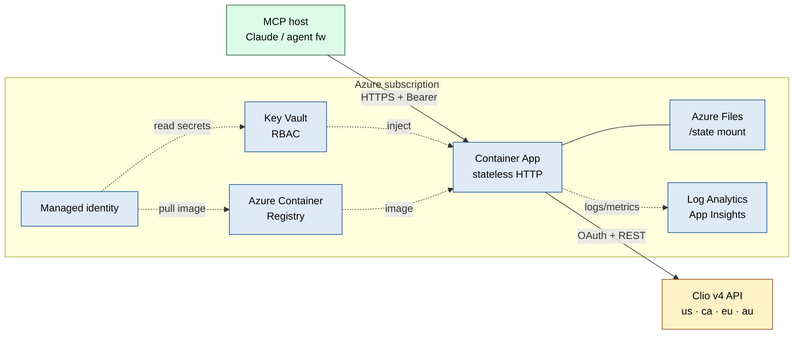

# Clio MCP

[](LICENSE)
[](https://nodejs.org)
[](https://www.typescriptlang.org)
[](https://modelcontextprotocol.io)
[](https://learn.microsoft.com/en-us/azure/container-apps/)
[](#roadmap)

> A Model Context Protocol server for **Clio Manage** — built to run firm-wide
> on Azure Container Apps, with a fully-featured local stdio path for
> development and single-user installs. Same binary, two transports.

This server is the boundary between an AI agent (Claude or any
MCP-compatible client) and your firm's Clio Manage instance. It speaks Clio
v4 fluently — matters, contacts, activities, tasks, notes, calendar,
documents, bills — and it does so behind OAuth-with-encrypted-tokens, an
append-only audit log, and bearer-token HTTPS auth in production.

**What's in the box**

- 41 tools across 11 Clio domains, plus a generic `clio_api_request` escape hatch
- A composite intake workflow (`clio_open_new_matter`) that chains client +
  matter + opening note + intake task into one agent action
- OAuth 2.0 authorization-code flow with AES-256-GCM token-at-rest
- Append-only JSONL audit log designed around ABA Formal Opinion 512

**What's different about this one**

- **Azure-native.** A single `azd up` provisions Container Apps + ACR + Key
  Vault + Azure Files + Log Analytics. Secrets flow from Key Vault to the
  container via managed identity — never on disk.
- **End-to-end verified.** `npm run smoke:stdio` and `npm run smoke:http`
  drive a real MCP session against the built binary. CI blocks regressions in
  protocol shape, tool registration, auth gating, and resource publication.
- **Multi-region.** US / CA / EU / AU Clio endpoints via one `CLIO_REGION` env.

---

## Contents

1. [What you can ask Claude](#what-you-can-ask-claude)
2. [Architecture](#architecture)
3. [Quick start — Azure](#quick-start--azure)
4. [Quick start — local](#quick-start--local)
5. [Tool catalog](#tool-catalog)
6. [Resources](#resources)
7. [Configuration](#configuration)
8. [Security & compliance posture](#security--compliance-posture)
9. [Cost (Azure)](#cost-azure)
10. [FAQ](#faq)
11. [Verification](#verification)
12. [Confirmed Clio API quirks](#confirmed-clio-api-quirks)
13. [Development](#development)
14. [Related work](#related-work)
15. [Roadmap](#roadmap)
16. [License](#license)

---

## What you can ask Claude

Once wired up, these are real prompts that route through the connector. The
tool calls happen transparently; the agent picks what to call from the catalog.

**Matter lookup**

> "Show me all open matters for Acme Corp."
> "What's the status of matter 2024-0042?"
> "Which matters have been updated since last Monday?"

**Time & billing**

> "How many hours has the team logged on matter 4821 this month?"
> "What's the outstanding balance on matter 4821 and when was the last
> invoice issued?"
> "List all unbilled time entries from Jane in April."

**Intake (composite workflow)**

> "Open a new matter for Jane Smith — landlord/tenant, flat fee $2,500.
> Add an opening note summarising the consultation, and create an intake
> task due Friday."

That last one is one `clio_open_new_matter` call that creates the contact,
opens the matter, applies the flat-fee custom rate, attaches the note, and
schedules the task.

**Drafting (writes a note)**

> "Add a note to matter 4821: today's call covered scope and engagement
> letter; client confirmed retainer."

**Calendar & tasks**

> "What do I have on the calendar between April 28 and May 2?"
> "Show my pending tasks across all open matters, grouped by priority."

**Reporting / cleanup**

> "List all bills in `awaiting_payment` state older than 60 days, grouped by
> client."
> "Find every contact created this year that isn't linked to a matter."

The connector retrieves Clio data live on every request. Nothing is cached
or mirrored.

---

## Architecture

Azure deployment (primary):

```
                    Azure subscription
   ┌─────────────────────────────────────────────────────────┐
   │                                                          │
   │   ┌────────────┐  HTTPS  ┌──────────────┐   ┌─────────┐ │
   │   │  MCP host  │────────►│ Container    │──►│ Clio v4 │ │
   │   │ (Claude /  │  Bearer │ Apps         │   │  API    │ │
   │   │  agent fw) │  token  │ (stateless)  │   └─────────┘ │
   │   └────────────┘         └──────┬───────┘                │
   │                                 │                        │
   │                  ┌──────────────┼──────────────┐         │
   │                  │              │              │         │
   │             ┌────▼─────┐  ┌─────▼──────┐ ┌─────▼──────┐ │
   │             │ Key Vault│  │ Azure Files│ │ App Insights│ │
   │             │  (RBAC)  │  │  /state    │ │ + Log Anal.│ │
   │             └──────────┘  └────────────┘ └────────────┘ │
   │                  ▲                                       │
   │         ┌────────┴─────────┐                             │
   │         │ Managed identity │                             │
   │         │ (KV secrets user │                             │
   │         │  + ACR pull)     │                             │
   │         └──────────────────┘                             │
   └─────────────────────────────────────────────────────────┘
```

Or as a Mermaid graph (renders inline on GitHub):



Resources provisioned by [`infra/main.bicep`](infra/main.bicep):

| Resource                             | Purpose                                                  |
|--------------------------------------|----------------------------------------------------------|
| Log Analytics + Application Insights | Logs, metrics, traces                                    |
| Azure Container Registry (Basic)     | Private image registry, anonymous pull disabled          |
| User-assigned managed identity       | ACR pull + Key Vault Secrets User                        |
| Azure Key Vault (RBAC, soft-delete)  | Stores Clio + bearer-token secrets                       |
| Azure Storage + File Share           | Persistent `/state` mount (tokens.enc + audit.log)       |
| Container Apps environment           | Hosts the workload, file share registered                |
| Container App                        | HTTPS ingress, autoscale 1→4 by default                  |

---

## Quick start — Azure

> Primary path. ~15 minutes the first time. Everything after step 2 is one-shot.

### Prerequisites

- Azure subscription with the `Microsoft.App` and `Microsoft.ContainerRegistry`
  providers registered
- `az`, `azd`, and Docker installed locally
- A **Clio Developer Application** with redirect URI
  `http://127.0.0.1:5678/callback` (one-time, used only to seed a refresh
  token from your laptop — never has to be cloud-reachable)

### 1. Provision

```bash
az login
azd auth login
azd env new clio-mcp-prod
azd env set AZURE_LOCATION eastus2
azd env set CLIO_REGION us           # us | ca | eu | au
azd up                                # builds image, runs Bicep, deploys
```

### 2. Populate Key Vault (5 secrets)

```bash
KV=$(azd env get-values | awk -F= '/AZURE_KEY_VAULT_NAME/{print $2}' | tr -d '"')

az keyvault secret set --vault-name "$KV" --name clio-client-id     --value "<from Clio>"
az keyvault secret set --vault-name "$KV" --name clio-client-secret --value "<from Clio>"
az keyvault secret set --vault-name "$KV" --name clio-encryption-key --value "$(openssl rand -hex 32)"

# A bearer token your MCP clients will present on /mcp:
TOKEN=$(openssl rand -base64 32 | tr -d '=+/' | head -c 48)
az keyvault secret set --vault-name "$KV" --name clio-http-auth-tokens --value "$TOKEN"
echo "Bearer token (save this): $TOKEN"

# One-time local OAuth dance to mint the refresh token used at cold start:
node examples/bootstrap-refresh-token.mjs > /tmp/refresh
az keyvault secret set --vault-name "$KV" --name clio-refresh-token --value "$(cat /tmp/refresh)"
shred -u /tmp/refresh 2>/dev/null || rm /tmp/refresh
```

### 3. Restart the revision so the secrets bind

```bash
APP=$(azd env get-values | awk -F= '/SERVICE_API_NAME/{print $2}' | tr -d '"')
RG=$(azd env get-values | awk -F= '/AZURE_RESOURCE_GROUP/{print $2}' | tr -d '"')
az containerapp revision restart -n "$APP" -g "$RG"
```

### 4. Verify

```bash
MCP_URL=$(azd env get-values | awk -F= '/SERVICE_API_MCP_ENDPOINT/{print $2}' | tr -d '"')
curl -sS "${MCP_URL%/mcp}/healthz"
# {"status":"ok","server":"clio-mcp","authenticated":true,"region":"us"}
```

Wire `$MCP_URL` into any MCP host that supports Streamable HTTP, presenting
`Authorization: Bearer $TOKEN`. Full walk-through (custom domain, logs,
export, rotation): [docs/deployment-azure.md](docs/deployment-azure.md).

---

## Quick start — local

> Development, single-user, or seeding the Azure refresh token.

```bash
git clone https://github.com/patrickking67/clio-mcp.git
cd clio-mcp
npm install
npm run build
cp .env.example .env
# fill: CLIO_CLIENT_ID, CLIO_CLIENT_SECRET, CLIO_ENCRYPTION_KEY (openssl rand -hex 32)
```

Wire into Claude Desktop / Claude Code with one of the
[examples/](examples/), then `authenticate with Clio` in a conversation.
The encrypted token blob lives at `~/.clio-mcp/tokens.enc` and auto-refreshes
ahead of expiry. Full guide: [docs/deployment-local.md](docs/deployment-local.md).

---

## Tool catalog

| Domain          | Tools                                                                                   |
|-----------------|-----------------------------------------------------------------------------------------|
| Auth            | `clio_authenticate` · `clio_auth_status` · `clio_logout` · `clio_who_am_i`              |
| Matters         | `clio_list_matters` · `clio_get_matter` · `clio_create_matter` · `clio_update_matter` · `clio_delete_matter` · `clio_list_matter_contacts` |
| Contacts        | `clio_search_contacts` · `clio_get_contact` · `clio_create_person_contact` · `clio_create_company_contact` · `clio_update_contact` · `clio_delete_contact` |
| Activities      | `clio_list_activities` · `clio_get_activity` · `clio_create_time_entry` · `clio_create_expense_entry` |
| Tasks           | `clio_list_tasks` · `clio_get_task` · `clio_create_task` · `clio_update_task`           |
| Notes           | `clio_list_notes` · `clio_create_note`                                                  |
| Calendar        | `clio_list_calendar_entries` · `clio_create_calendar_entry` · `clio_list_calendars`     |
| Documents       | `clio_list_documents` · `clio_get_document` · `clio_get_document_download_url` · `clio_list_folders` |
| Bills           | `clio_list_bills` · `clio_get_bill` · `clio_get_billing_summary`                        |
| Users           | `clio_list_users` · `clio_get_user`                                                     |
| Practice areas  | `clio_list_practice_areas`                                                              |
| Workflows       | `clio_open_new_matter` (client + matter + flat-fee + note + task in one call)           |
| Escape hatch    | `clio_api_request` (raw v4 endpoint with `{ data: ... }` wrapping)                      |

Destructive operations (`clio_delete_*`, `DELETE` via `clio_api_request`) are
disabled unless `CLIO_ALLOW_DESTRUCTIVE=true`.

---

## Resources

The server publishes two MCP resources that clients may auto-include at
session start:

| URI                          | What it carries                                                |
|------------------------------|----------------------------------------------------------------|
| `clio://compliance/notice`   | ABA Opinion 512 reminder + audit-logging summary               |
| `clio://auth/status`         | Live JSON view of authentication state and configuration       |

---

## Configuration

| Variable                      | Required | Default          | Purpose                                                                |
|-------------------------------|----------|------------------|------------------------------------------------------------------------|
| `CLIO_CLIENT_ID`              | yes      | —                | From your Clio Developer Application                                   |
| `CLIO_CLIENT_SECRET`          | yes      | —                | From your Clio Developer Application                                   |
| `CLIO_ENCRYPTION_KEY`         | yes      | —                | 64-hex (32 bytes). `openssl rand -hex 32`                              |
| `CLIO_REGION`                 | no       | `us`             | `us` / `ca` / `eu` / `au`                                              |
| `CLIO_TRANSPORT`              | no       | `stdio`          | `stdio` or `http`. CLI flags `--stdio` / `--http` override              |
| `CLIO_HTTP_PORT`              | no       | `8765`           | HTTP transport port                                                    |
| `CLIO_HTTP_HOST`              | no       | `0.0.0.0`        | HTTP transport bind                                                    |
| `CLIO_HTTP_AUTH_TOKENS`       | no       | (open!)          | Comma-separated bearer tokens. **Required in production.**             |
| `CLIO_BOOTSTRAP_REFRESH_TOKEN`| no       | —                | One-shot refresh token used on first boot if no encrypted blob exists  |
| `CLIO_REDIRECT_PORT`          | no       | `5678`           | Loopback port for OAuth callback                                       |
| `CLIO_REDIRECT_HOST`          | no       | `127.0.0.1`      | Loopback host for OAuth callback                                       |
| `CLIO_STATE_DIR`              | no       | `~/.clio-mcp/`   | Where the encrypted token blob and audit log live                      |
| `CLIO_AUDIT_MODE`             | no       | `metadata`       | `none` / `metadata` / `full`                                           |
| `CLIO_ALLOW_DESTRUCTIVE`      | no       | `false`          | Enables DELETE endpoints                                                |
| `CLIO_DEFAULT_PAGE_SIZE`      | no       | `25`             | Records per Clio API page                                              |
| `CLIO_MAX_PAGE_SIZE`          | no       | `200`            | Hard cap on total records returned by a list tool                      |
| `CLIO_DEFAULT_USER_ID`        | no       | —                | Default attorney/user id for matter creation                           |
| `LOG_LEVEL`                   | no       | `info`           | `error` / `warn` / `info` / `debug`                                    |

---

## Security & compliance posture

**At a glance**

| Layer                       | What this server does                                                | What you should still do                                              |
|-----------------------------|----------------------------------------------------------------------|------------------------------------------------------------------------|
| OAuth                       | Authorization-code with CSRF state; no password is ever seen by us  | Use a single Clio Developer Application per deployment                |
| Token storage               | AES-256-GCM at rest; key in Key Vault (Azure) or env (local)        | Rotate `clio-encryption-key` on offboarding                            |
| HTTP transport              | Bearer-token required; `timingSafeEqual` on SHA-256 digests          | Rotate `clio-http-auth-tokens` per caller / per departure              |
| Audit                       | Append-only JSONL of every tool call (metadata or redacted args)     | Export + retain per firm policy; the server does not rotate            |
| Destructive operations      | Off by default (`CLIO_ALLOW_DESTRUCTIVE=false`)                      | Keep off unless you have a specific reason                             |
| Telemetry                   | None. Only outbound call is to your configured Clio region's API     | Pair with Claude Enterprise / API+ZDR for conversation-side controls   |

**Detail**

- OAuth 2.0 with a cryptographically random `state` parameter for CSRF
  protection. The user logs in directly on Clio's domain.
- The encryption key never leaves the host. Tampered ciphertext fails
  decryption — `AES-256-GCM` is authenticated encryption, so partial /
  tampered token blobs cannot be silently used.
- The audit log captures: ISO timestamp, tool name, outcome, duration in ms,
  Clio user id, matter id (when applicable), result count, transport
  identifier. In `full` mode it also records argument payloads with
  redaction of known-secret keys.
- The HTTP transport is **stateless POST-only** on `/mcp`. `GET` and `DELETE`
  return 405. The bearer-token check uses constant-time comparison to avoid
  timing side channels.

Threat model + Azure-specific notes: [docs/security.md](docs/security.md).

---

## Cost (Azure)

For a typical firm at moderate volume (single-digit-thousands of tool
calls/day) running one warm replica:

| Component                  | Approx. monthly |
|----------------------------|-----------------|
| Container App (0.5 vCPU, 1 GiB) | ~$15       |
| Container Apps environment | included        |
| Azure Container Registry (Basic) | ~$5      |
| Key Vault (standard, low ops) | <$1          |
| Azure Files (10 GiB, transactional) | ~$1   |
| Log Analytics (light usage) | ~$2–5          |
| Application Insights        | included with workspace |
| **Total**                  | **~$25–30/mo**  |

Setting `minReplicas=0` (scale-to-zero) trades a 3–5s cold start on the
first request after idle for ~80% lower Container App spend.

---

## FAQ

**Is this safe for client matter data?**
It's built for it. OAuth tokens are encrypted at rest, every tool call is
audited, no data is cached or mirrored, and no outbound calls happen besides
Clio. But this server only secures the Clio-to-AI boundary — pair it with
**Claude Enterprise** or the **Claude API with Zero Data Retention** so
that the conversations themselves get the right handling.

**Does Claude train on what we send through this?**
It depends entirely on the Claude tier you pair this with. Claude Pro/Max
(consumer): Anthropic does not train on chats by default. Claude Team /
Enterprise: explicit no-training contract. Claude API with ZDR: no training,
no retention. This server doesn't change any of that; the tier choice you
make matters far more than anything in this codebase.

**We're on Clio EU / CA / AU. Does it work?**
Yes. Set `CLIO_REGION` to `eu`, `ca`, or `au` and the server routes OAuth +
API + tokens against the matching regional host. Tokens minted in one region
will not authenticate in another, by design.

**How do we revoke access?**
Any of three places. (a) Local: call `clio_logout` to wipe the encrypted
token blob. (b) Azure: delete the `clio-refresh-token` Key Vault secret and
restart the revision. (c) Clio side: revoke the Developer Application in
*Settings → Developer Applications*. The third is the only one Clio sees
explicitly.

**Do we have to use Azure?**
No. Local stdio works completely standalone. Azure Container Apps is the
primary production path because it's the cleanest match for a stateless
MCP gateway (HTTPS ingress, managed identity, file mount, scale-to-zero),
but the Docker image runs on EKS, ECS, Fly, Render, or any other container
host — only the secret-injection wiring needs to change.

**Can we use this with hosts besides Claude?**
Yes. It speaks standard MCP. Verified against Claude Desktop, Claude Code,
and the MCP Inspector; expected to work with any client that implements
either stdio or Streamable HTTP transport.

**What's the trust story for installing this?**
This isn't on npm. Clone, audit, build from source. No telemetry. The only
outbound calls go to your configured Clio region's API.

---

## Verification

Two protocol-level smoke tests drive a real MCP session against the built
binary. They assert on tool count, resource publication, auth enforcement,
and error shape. Both run on every commit ([build.yml](.github/workflows/build.yml)).

```bash
npm run build
npm run smoke:stdio    # raw JSON-RPC over spawned --stdio child
npm run smoke:http     # SDK Client over Streamable HTTP against spawned --http child
```

A passing stdio run:

```
✓ initialize -> clio-mcp 0.1.0
✓ tools/list -> 41 tools
✓ tool catalog includes expected names
✓ resources/list -> 2 resources
✓ resources/read clio://auth/status -> authenticated:false
✓ tools/call clio_who_am_i (no auth) -> isError:true
ALL CHECKS PASSED ✓
```

A passing HTTP run:

```
✓ /healthz ready
✓ /mcp without bearer -> 401
✓ /mcp with wrong bearer -> 401
✓ Client.connect (initialize round-trip) succeeded
✓ tools/list -> 41 tools
✓ resources/read clio://auth/status -> authenticated:false
✓ GET /mcp -> 405 (server is stateless POST-only)
ALL HTTP CHECKS PASSED ✓
```

---

## Confirmed Clio API quirks

Empirical findings from Clio v4 that surprised someone. Baked into the
client + tool descriptions so they don't surprise you, and listed here so
the next person doesn't have to re-derive:

- **`billing_method` at the matter root is silently ignored.** To set a flat
  fee, PATCH the matter with `custom_rate: { type: "FlatRate", rates: [...] }`.
  `clio_create_matter`'s `flat_rate_amount` parameter does this for you.
- **`TimeEntry.total = quantity_in_hours × rate`** (NOT `× price`). For
  flat-fee line items use `clio_create_expense_entry` (`total = quantity ×
  price`).
- **Activities GET requires explicit `fields`** — a bare GET returns only id
  + etag. `description` is write-only; on GET use `note`. `rate` is not a
  valid GET field.
- **Activities list filter is `matter_id` (singular int).** `matter` and
  `matter[id]` are silently ignored — you'll get account-wide results back
  with no error.
- **Mutating payloads must be wrapped `{ data: ... }`.** The dedicated tools
  do this for you. `clio_api_request` wraps when you pass `data:`; pass
  `body:` to send something verbatim.
- **Address `name` is enum-validated** — exactly `Work`, `Home`, `Billing`,
  or `Other`. The tools coerce invalid names to `Work`.
- **DELETE on bills is soft-delete (void).** The bill moves to `void` state
  rather than disappearing.
- **Region cross-talk fails.** A token minted at `app.clio.com` will not
  authenticate against `eu.app.clio.com`. Pick one and stick with it.

---

## Development

```bash
npm install
npm run dev:stdio        # tsx watch, stdio mode
npm run dev:http         # tsx watch, http mode
npm run lint             # tsc --noEmit
npm run build            # tsc + chmod +x
npm run smoke:stdio      # protocol smoke test (stdio)
npm run smoke:http       # protocol smoke test (http)
npm run inspector        # MCP Inspector against the built binary
```

The MCP Inspector is the fastest way to iterate on tool schemas against a
real Clio account. Source map and declaration files ship with the build so
debuggers and IDEs work out of the box.

Project layout:

```
src/
├── index.ts              entry point — picks transport from --stdio/--http
├── config.ts             env loading + region routing
├── server.ts             McpServer factory
├── audit.ts              JSONL audit log with secret redaction
├── resources.ts          clio:// MCP resources
├── auth/                 OAuth code flow + AES-256-GCM token store
├── clio/                 HTTP client (auth refresh, retry, pagination)
├── transports/           stdio + Streamable HTTP
├── tools/                13 modules, ~41 tools
└── util/                 stderr logger, error types
infra/main.bicep          Container Apps + ACR + Key Vault + Files
Dockerfile                multi-stage build, distroless-style runtime
scripts/smoke-*.mjs       end-to-end MCP protocol tests
docs/                     deployment-local, deployment-azure, oauth, security
examples/                 client configs + bootstrap-refresh-token.mjs
```

---

## Related work

Two prior open-source Clio MCP implementations informed this one, and both
are worth reading if you're evaluating options:

- **[oktopeak/clio-mcp](https://github.com/oktopeak/clio-mcp)** — TypeScript,
  local-stdio focused, ~15 read-mostly tools. Strong on the law-firm-IT
  install ergonomics; ships an npm package with a clean 6-step setup.
- **[lawyered0/clio-mcp](https://github.com/Lawyered0/clio-mcp)** — Python /
  FastMCP, with a deeply documented set of Clio API quirks (flat-fee
  `custom_rate` setup, activity field aliases, region routing). Most of the
  quirks section in this README originates from that prior empirical work.

This implementation contributes: **Azure-native deployment** with Bicep + azd,
**broader tool surface** (41 vs. ~15), **stateless Streamable HTTP transport**
with bearer-token auth, **end-to-end protocol smoke tests** in CI, and a
**composite intake workflow** that chains the most common matter-opening
sequence into one agent action.

---

## Roadmap

- OS-keychain integration for the encryption key (macOS Keychain, Linux
  secret-service, Windows Credential Manager) so the key isn't on disk.
- Multi-tenant HTTP mode: one MCP endpoint, many firms, per-caller bearer
  token → per-firm OAuth state.
- Private Endpoint + Front Door / API Management options in Bicep.
- DXT packaging for one-click Claude Desktop install.
- Webhook subscription tool for live matter / task / bill events.
- Per-tool scope minimization (today the OAuth dance asks the broad set).

---

## License

MIT — see [LICENSE](LICENSE).
